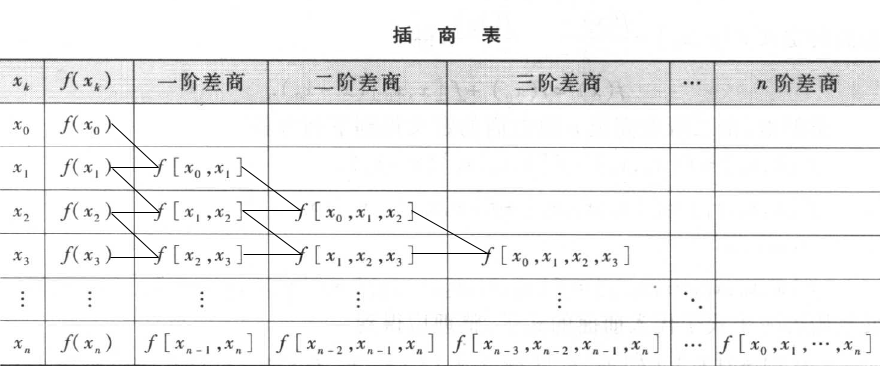

# 插值法

- 拉格朗日插值
- 牛顿插值

#### 拉格朗日插值

&emsp;拉格朗日基函数:

$$
    l_i(x) = \prod_{j \neq i}^{1 \le j \le n} \frac{(x-x_j)}{(x_i-x_j)}
$$

&emsp;拉格朗日插值函数:

$$
    f_i(x) = \sum_{i=1}^{n} y_i \ast l_i(x)
$$

&emsp;例题：

&emsp;解析：

&emsp;一、先求出$x_i$和$y_i$

$$
    x_0=0,y_0=1 \\
    x_1=1,y_1=2 \\
    x_2=2,y_2=3
$$

&emsp;二、再求拉格朗日基函数，已知三个点，需要三个点的基函数：

$$
    l_0 = \frac{(x-x_1)(x-x_2)}{(x_0-x_1)(x_0-x_2)} \\
$$

$$
    l_1 = \frac{(x-x_0)(x-x_2)}{(x_1-x_0)(x_1-x_2)}
$$

$$
    l_2 = \frac{(x-x_0)(x-x_1)}{(x_2-x_0)(x_2-x_1)}
$$

&emsp;三、最后带入拉格朗日基函数

$$
    f_3(x) = y_0 * l_0 + y_1 * l_1 + y_2 * l_2
$$

&emsp;计算得：$f_3(x) = x + 1$

#### 牛顿插值

&emsp;前置概念：`差商`

&emsp;一阶差商：

$$
    f[x_i,x_j] = \frac{f(x_i) - f(x_j)}{x_i - x_j}
$$

&emsp;二阶差商：

$$
    f[x_i,x_j,x_k] = \frac{f[x_i,x_j] - f[x_j,x_k]}{x_i-x_k}
$$

&emsp;$n$阶差商：

$$
    f[x_0,x_1,...,x_n] = \frac{f[x_0,x_1,...,x_{n-1}] - f[x_1,x_2,...,x_n]}{x_0 - x_n}
$$

&emsp;牛顿插值公式：

$$
    N_n(x) = f(x_0) + f[x_0,x_1](x-x_0) + f[x_0,x_1,x_2](x-x_0)(x-x_1) \\
    +...+f[x_0,x_1,...,x_n-1,x_n] \prod_{j=0}^{n-1}(x-x_j)
$$

&emsp;例题：

&emsp;一、先确定$x_i,y_i,f(x)$.

$$
    x_0 = 1,y_0=1 \\
    x_1 = 4,y_1=2 \\
    x_2 = 9,y_2=3 \\
    f(x) = \sqrt{x}
$$

&emsp;二、再求差商表

&emsp;三、最后得到牛顿插值多项式

$$
    N_2(x) = f(x_0) + f[x_0,x_1](x-x_0) + f[x_0,x_1,x_2](x-x_0)(x-x_1) \\
    = 1 + 0.33333 * (x - 1) - 0.01667(x-1)(x-4) \\
$$

&emsp;带入$x=7$，得：

$$
N_2(7) = 2.69992
$$

