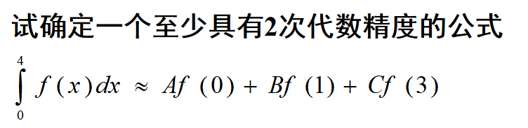
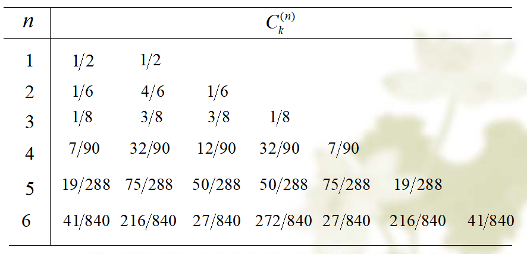

# 数值积分

- 求积公式的代数精度
- Newton-Cotes求积公式
- 复化梯形求积公式
- 复化Simpson公式
- 复化Cotes公式

#### 求积公式的代数精度

&emsp;要使机械求积公式：

$$
    \int_a^bf(x)dx \approx{\sum_{k=0}^nA_kf(x_k)}
$$

&emsp;具有m次代数精度，则需要使求积公式对$f(x) = 1,x^1,x^2,...,x^m$都准确成立。

&emsp;其中：

$$
   I_n = \sum_{k=0}^nA_kf(x_k) \\
   A_k = \int_a^b{l_k(x)dx} = \int_a^b\prod_{i=0 \& i\neq k}^n \frac{(x-x_i)}{x_k-x_i}dx
$$

&emsp;属于插值型求积公式.

&emsp;对于求积公式：

$$
    I_n = \sum_{k=0}^n{A_kf(x_k)}
$$

&emsp;至少有$n$次代数精度，则该求积公式属于插值型求积公式，同时有：

$$
    \sum_{k=0}^nA_k = b-a
$$

##### 例题：

&emsp;至少具有2次代数精度，则对$f(x) = 1,x,x^2$，求积公式均准确成立。因此可列出如下方程组：

$$
\begin{cases}
    A + B + C = 4 \\
    B + 3C = 8 \\
    B + 9C = \frac{64}{3}
\end{cases}
$$

&emsp;解得：$A=\frac{4}{9},B=\frac{4}{3},C=\frac{20}{9}$

#### Newton-Cotes求积公式

&emsp;Newton-Cotes求积公式如下：

$$
    I_n = (b-a) \sum_{k=0}^n{C_k^{(n)}}f(x_k)
$$

其中$c_k^{(n)}$称为Cotes系数。系数值如下：

#### 复化梯形求积公式

$$
    \int_a^bf(x)dx \approx \frac{h}{2} \lbrack f(a) + 2\sum_{k=1}^{n-1}f(x_k) + f(b) \rbrack = T_n
$$

&emsp;其中，$h = \frac{b-a}{n},x_k = a + kh(k=0,1,...,n)$

#### 复化Simpson公式

$$
    \int_a^bf(x)dx \approx \frac{h}{6} \lbrack f(a) + 4 \sum_{k=0}^{n-1}f(x_{x + \frac{1}{2}}) + 2 \sum_{k=1}^{n-1}f(x_k) + f(b) \rbrack = S_n
$$

&emsp;其中,$h = \frac{b-a}{n},x_k = a + kh (k=0,...,n)$

#### 复化Cotes公式

$$
    \int_a^bf(x)dx \approx \sum_{k=0}^{n-1}\frac{h}{90} \lbrack 7f(x_k) + 32f(x_{k + \frac{1}{4}}) + 12f(x_{k + \frac{1}{2}}) + 32f(x_{k+\frac{3}{4}}) + 7f(x_{x+1})  \rbrack = C_n
$$

&emsp;其中,$h = \frac{b-a}{n},x_k = a + kh (k=0,...,n)$
